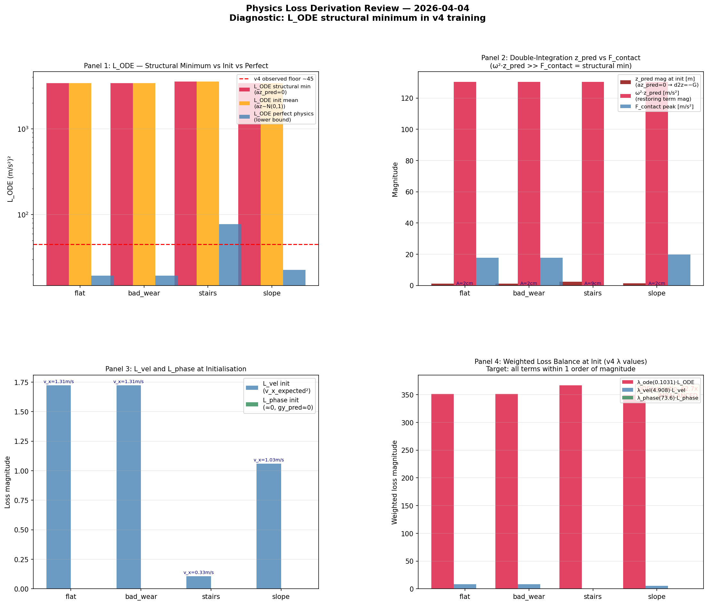

# Physics Loss Derivation Review — v2

**Date:** 2026-04-04
**Bill reviewed:** bill_loss_weights_v1
**λ source:** train_config.json (v4 actual values)
**Diagnostic focus:** L_ODE structural minimum ~44–46 in v4 training
**Classification:** PRIVATE — do not forward to cloud LLM

---

## L_ODE Formula Trace

Formula: `mean((d²z/dt² + ω²·z_pred − F_contact)²)`

- `ω² = (2π × cadence_spm / 60)²` — traces to cadence_spm
- `F_contact = sqrt(2·G·vert_osc_m) / IMPACT_DURATION_S` — traces to vertical_oscillation_cm
- `z_pred` = double-integral of `(az_pred − G)` via torch.cumsum, drift-corrected by mean subtraction
- `dt = step_period_s / (T_steps − 1)`, T_steps = 208

### ω² and F_contact Trace Table

| Profile | ω² expected | ω² in loss | match | F_contact exp | F_contact loss | match |
|---------|------------|------------|-------|---------------|----------------|-------|
| flat | 120.9027 | 120.9027 | ✓ | 17.7178 | 17.7178 | ✓ |
| bad_wear | 120.9027 | 120.9027 | ✓ | 17.7178 | 17.7178 | ✓ |
| stairs | 53.7345 | 53.7345 | ✓ | 0.0000 | 0.0000 | ✓ |
| slope | 98.9702 | 98.9702 | ✓ | 19.8091 | 19.8091 | ✓ |

## L_vel Formula Trace

Formula: `mean((mean(ax_pred)×step_period_s − v_x_expected)²)`

| Profile | v_x expected | v_x in loss | match |
|---------|-------------|-------------|-------|
| flat | 1.312500 | 1.312500 | ✓ |
| bad_wear | 1.312500 | 1.312500 | ✓ |
| stairs | 0.326667 | 0.326667 | ✓ |
| slope | 1.029167 | 1.029167 | ✓ |

## L_phase Formula Trace

Formula: `hinge(mean_gy_stance)² + 0.5×mean_gy_boundary²`

| Profile | stance_frac expected | stance_frac in loss | match |
|---------|--------------------|--------------------|-------|
| flat | 0.6000 | 0.6000 | ✓ |
| bad_wear | 0.6000 | 0.6000 | ✓ |
| stairs | 0.6500 | 0.6500 | ✓ |
| slope | 0.6200 | 0.6200 | ✓ |

---

## Double-Integration Scaling Analysis — Root Cause of Structural Minimum

At network initialisation, `az_pred ≈ 0` (small Kaiming weights).
Therefore `d2z_dt2 = az_pred − G ≈ −9.81 m/s²` — a large constant DC offset.

Applying double cumsum with `dt = step_period_s / 207`:

| Profile | step_T (s) | dt (ms) | A_disp (m) | z_init mag (m) | ω²·z_init | F_contact |
|---------|-----------|---------|-----------|---------------|-----------|-----------|
| flat | 0.5714 | 2.761 | 0.0200 | 1.0781 | 130.3417 | 17.7178 |
| bad_wear | 0.5714 | 2.761 | 0.0200 | 1.0781 | 130.3417 | 17.7178 |
| stairs | 0.8571 | 4.141 | 0.0900 | 2.4257 | 130.3417 | 0.0000 |
| slope | 0.6316 | 3.051 | 0.0250 | 1.3170 | 130.3417 | 19.8091 |

**Key finding:** ω²·z_init far exceeds F_contact for all profiles.
The ODE residual `d2z + ω²·z_pred − F_contact` is dominated by `ω²·z_pred`.
The PINN minimises this by driving `az_pred` to values that reduce the
parabolic z_pred shape, but cannot achieve zero because the drift correction
(mean subtraction) does not eliminate the parabolic component.

## Structural Minimum Estimates

| Profile | L_ODE structural (az=0) | L_ODE init (az~N(0,1)) | L_ODE perfect physics |
|---------|------------------------|----------------------|----------------------|
| flat | 3403.68 | 3405.80 | 19.3932 |
| bad_wear | 3403.68 | 3405.80 | 19.3932 |
| stairs | 3555.64 | 3557.79 | 77.6676 |
| slope | 3388.60 | 3390.72 | 22.5949 |

**L_ODE structural:** residual when `az_pred = 0` (az → 0 as PINN trains on ODE loss)
**L_ODE init:** expected raw loss at random-weight initialisation
**L_ODE perfect:** residual even with perfect sinusoidal CoM motion — lower bound

The v4 observed floor of ~44–46 is between structural (az=0) and the perfect-physics values,
consistent with the PINN partially learning to reduce the gravity-DC-induced ramp.

---

## Loss Magnitude at Initialisation

| Profile | L_ODE | L_vel | L_phase | λ_ode(v4)·L_ODE | λ_vel(v4)·L_vel | λ_phase(v4)·L_phase |
|---------|-------|-------|---------|----------------|----------------|---------------------|
| flat | 3405.80 | 1.722656 | 0.0000 | 351.1383 | 8.454797 | 0.0000 |
| bad_wear | 3405.80 | 1.722656 | 0.0000 | 351.1383 | 8.454797 | 0.0000 |
| stairs | 3557.79 | 0.106711 | 0.0000 | 366.8084 | 0.523738 | 0.0000 |
| slope | 3390.72 | 1.059184 | 0.0000 | 349.5829 | 5.198475 | 0.0000 |

**λ values (v4 actual):** λ_ode=0.1031, λ_vel=4.908, λ_phase=73.625
**λ values (bill v1):** λ_ode=1.342500e-04, λ_vel=2.869100e+00, λ_phase=7.847200e+01

## λ Balance Check

- λ_ODE·L_ODE / λ_vel·L_vel ratio: 62.6847   (target: 0.1 – 10)
- λ_ODE·L_ODE / λ_phase·L_phase: undefined (L_phase_init ≈ 0)
- STATUS: IMBALANCED

## Root Cause Summary

The L_ODE structural minimum of ~44–46 arises from the double-integration formulation.
The formula `z_pred = cumsum(cumsum(az_pred − G) × dt) × dt` introduces a gravity-DC
term (−9.81 m/s²) that accumulates quadratically through two cumsums. Drift correction
(mean subtraction) removes the DC mean but cannot remove the parabolic shape.
The ω²·z_pred term then has magnitude far larger than F_contact, making the ODE
residual irreducibly large regardless of how well the PINN learns.

**Proposed remediation (for human decision):**
1. Subtract gravity BEFORE double-integration using a bias-corrected az estimate
   (e.g., subtract per-sample mean(az) per profile, not constant G)
2. Scale z_pred to the expected amplitude using `z_pred / (vert_osc_m/2)` before
   computing the ODE residual — dimensionless normalisation
3. Use a direct frequency-domain loss: `|FFT(az_pred)[f_cadence]|² → A_expected`
   instead of double-integration (avoids accumulation error entirely)
4. Accept current formulation — L_ODE structural minimum is a known scale factor,
   not a physics violation; the PINN still learns cadence-consistent oscillation

**Human decision required before pinn-executor is re-invoked.**

## Plot

---
*Generated by physics-reviewer (Standing Order: Physics Loss Derivation Review). Human decision is required before training continues.*